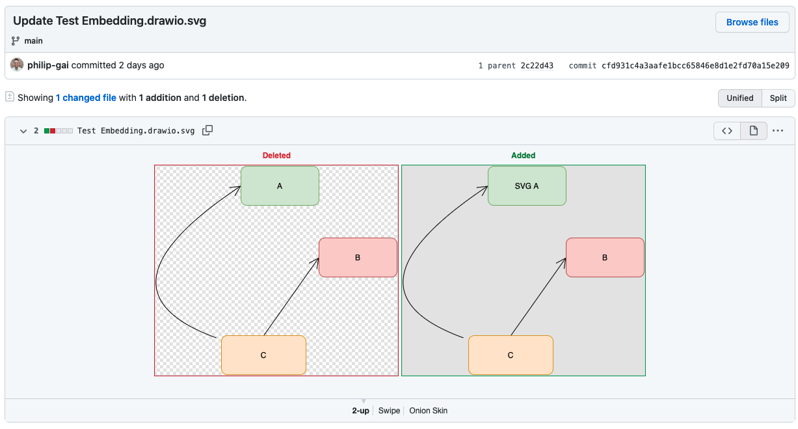
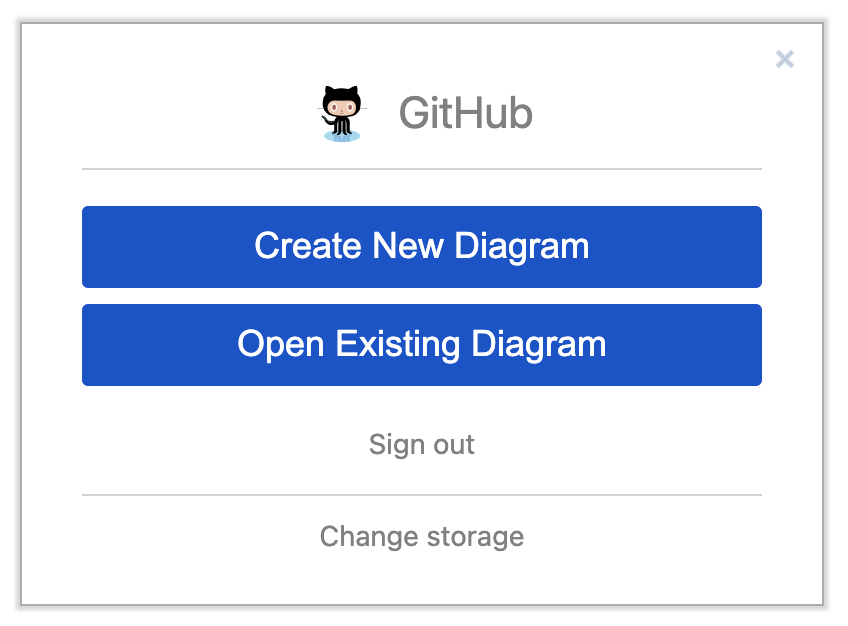

# github-drawio

How to use diagrams.net (draw.io) diagrams in your GitHub repo.

Reference: <https://github.com/jgraph/drawio-github>

## Benefits of using diagrams.net in GitHub repositories

1. Diagrams are stored in your repository with your code and docs
2. Diagram access is controlled by GitHub repository access
3. Diagrams are version-controlled using git
4. Create PRs with diagram updates to get approvals and feedback
5. One-click diagram editing from your GitHub repository
6. diagrams.net is open-source: <https://github.com/jgraph/drawio>



## How to integrate diagrams.net (draw.io) with your GitHub repo

1. Open draw.io in GitHub mode (<https://app.diagrams.net/?mode=github>)
2. Authorize with GitHub\
    
3. Choose the file you would like to edit OR Create a diagram in a new location
    - File should be editable bitmap image png or svg
    
    
4. Make changes, save and commit
5. Your png or svg file is now in your repo and contains a copy of your diagram in its metadata
6. In your markdown
    1. Reference the image like you would to any image
    2. On click, have the user navigate to diagrams.net and begin editing

    ```markdown
    [](https://app.diagrams.net/#Hphilip-gai%2Fgithub-drawio%2Fmain%2FTest%20Embedding.drawio.png)
    ```

## Real Examples

### SVG

- Allows you to have clickable links
- Better quality than png

[](https://app.diagrams.net/#Hphilip-gai%2Fgithub-drawio%2Fmain%2FTest%20Embedding.drawio.svg)

### PNG

[](https://app.diagrams.net/#Hphilip-gai%2Fgithub-drawio%2Fmain%2FTest%20Embedding.drawio.png)

## Notes

- Images in markdown are cached and can take a few minutes to update
- The edit link has to reference what branch to edit the diagram on. In this case I used `main`

[Rich Diffs]: https://docs.github.com/en/github/collaborating-with-pull-requests/proposing-changes-to-your-work-with-pull-requests/about-comparing-branches-in-pull-requests#diff-view-options
